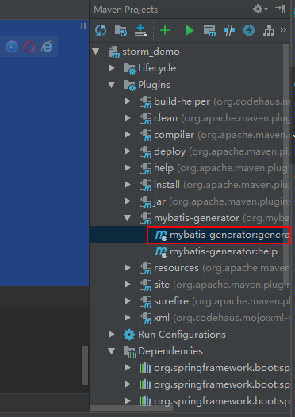

# 使用
提供以下功能：

### 重命名插件
支持把默认的`Mapper`改为其它名称，如`Dao`，其会把默认的XXMapper.java生成在指定目录的mgb目录下，xml生成在指定目录
的mbg下，其使用只需要generator中添加如下
```
<plugin type="com.hfjy.mybatis.generator.RenamePlugin">
    <property name="searchString" value="Mapper"/>
    <property name="replaceString" value="Dao"/>
</plugin>
```

如在generatorConfig.xml中指定如下：

```
<!-- !!!! Model Configurations !!!! -->
<javaModelGenerator targetPackage="com.hfjy.monitor.aly.model" targetProject="src/main/java">
    <property name="enableSubPackages" value="true"/>
    <property name="trimStrings" value="true"/>
</javaModelGenerator>

<!-- !!!! Mapper XML Configurations !!!! -->
<sqlMapGenerator targetPackage="mapper" targetProject="src/main/resources">
    <property name="enableSubPackages" value="true"/>
</sqlMapGenerator>

<!-- !!!! Mapper Interface Configurations !!!! -->
<javaClientGenerator targetPackage="com.hfjy.monitor.aly.dao" targetProject="src/main/java" type="XMLMAPPER">
    <property name="enableSubPackages" value="true"/>
</javaClientGenerator>
```

则生成目录如下：
```
src
├── main
│   ├── java
│   │   └── com
│   │       ├── hfjy
│   │       │   └── monitor
│   │       │       └── aly
│   │       │           ├── App.java
│   │       │           ├── config
│   │       │           │   └── AppConfig.java
│   │       │           ├── controller
│   │       │           │   └── IndexController.java
│   │       │           ├── dao
│   │       │           │   ├── custom
│   │       │           │   │   ├── EcsInfoDao.java
│   │       │           │   │   ├── InfoDetailRelationDao.java
│   │       │           │   │   ├── SlbDetailDao.java
│   │       │           │   │   ├── SlbEcsRelationDao.java
│   │       │           │   │   └── SlbInfoDao.java
│   │       │           │   └── mbg
│   │       │           │       ├── EcsInfoMBGDao.java
│   │       │           │       ├── InfoDetailRelationMBGDao.java
│   │       │           │       ├── SlbDetailMBGDao.java
│   │       │           │       ├── SlbEcsRelationMBGDao.java
│   │       │           │       └── SlbInfoMBGDao.java
│   │       │           ├── model
│   │       │           │   ├── EcsInfo.java
│   │       │           │   ├── InfoDetailRelation.java
│   │       │           │   ├── SlbDetail.java
│   │       │           │   ├── SlbEcsRelation.java
│   │       │           │   └── SlbInfo.java
│   │       │           └── service
│   │       │               └── EcsInfoService.java
│   │       └── liukun
│   │           └── storm
│   │               └── jdbc
│   │                   ├── JDBCDemo.java
│   │                   └── MyDemoSpout.java
│   └── resources
│       ├── application.yml
│       ├── generatorConfig.xml
│       ├── log4j2.xml
│       ├── mapper
│       │   ├── custom
│       │   │   ├── EcsInfoDao.xml
│       │   │   ├── InfoDetailRelationDao.xml
│       │   │   ├── SlbDetailDao.xml
│       │   │   ├── SlbEcsRelationDao.xml
│       │   │   └── SlbInfoDao.xml
│       │   └── mbg
│       │       ├── EcsInfoMBGMapper.xml
│       │       ├── InfoDetailRelationMBGMapper.xml
│       │       ├── SlbDetailMBGMapper.xml
│       │       ├── SlbEcsRelationMBGMapper.xml
│       │       └── SlbInfoMBGMapper.xml
│       └── mybatis-config.xml
```

如果不需要替换文件名，则可以直接这么引用：

```
<plugin type="com.hfjy.mybatis.generator.RenamePlugin"/>
```

其生成格式如下：

```
src
├── main
│   ├── java
│   │   └── com
│   │       ├── hfjy
│   │       │   └── monitor
│   │       │       └── aly
│   │       │           ├── App.java
│   │       │           ├── config
│   │       │           │   └── AppConfig.java
│   │       │           ├── controller
│   │       │           │   └── IndexController.java
│   │       │           ├── dao
│   │       │           │   ├── custom
│   │       │           │   │   ├── EcsInfoMapper.java
│   │       │           │   │   ├── InfoDetailRelationMapper.java
│   │       │           │   │   ├── SlbDetailMapper.java
│   │       │           │   │   ├── SlbEcsRelationMapper.java
│   │       │           │   │   └── SlbInfoMapper.java
│   │       │           │   └── mbg
│   │       │           │       ├── EcsInfoMBGMapper.java
│   │       │           │       ├── InfoDetailRelationMBGMapper.java
│   │       │           │       ├── SlbDetailMBGMapper.java
│   │       │           │       ├── SlbEcsRelationMBGMapper.java
│   │       │           │       └── SlbInfoMBGMapper.java
│   │       │           ├── model
│   │       │           │   ├── EcsInfo.java
│   │       │           │   ├── InfoDetailRelation.java
│   │       │           │   ├── SlbDetail.java
│   │       │           │   ├── SlbEcsRelation.java
│   │       │           │   └── SlbInfo.java
│   │       │           └── service
│   │       │               └── EcsInfoService.java
│   │       └── liukun
│   │           └── storm
│   │               └── jdbc
│   │                   ├── JDBCDemo.java
│   │                   └── MyDemoSpout.java
│   └── resources
│       ├── application.yml
│       ├── generatorConfig.xml
│       ├── log4j2.xml
│       ├── mapper
│       │   ├── custom
│       │   │   ├── EcsInfoMapper.xml
│       │   │   ├── InfoDetailRelationMapper.xml
│       │   │   ├── SlbDetailMapper.xml
│       │   │   ├── SlbEcsRelationMapper.xml
│       │   │   └── SlbInfoMapper.xml
│       │   └── mbg
│       │       ├── EcsInfoMBGMapper.xml
│       │       ├── InfoDetailRelationMBGMapper.xml
│       │       ├── SlbDetailMBGMapper.xml
│       │       ├── SlbEcsRelationMBGMapper.xml
│       │       └── SlbInfoMBGMapper.xml
│       └── mybatis-config.xml
```

### 生成注释
为`Model`和`Mapper`修改基属性及方法上的注释，需添加如下：
```
<plugin type="com.hfjy.mybatis.generator.CommentPlugin"></plugin>
```

### 使用
在idea中安装好mbatis插件后，在src/resource目录中创建generatorConfig.xml文件，并在其中配置要生成的信息。

然后在pom.xml中的`<plugins>`中配置如下内容：

```
<plugin>
    <groupId>org.mybatis.generator</groupId>
    <artifactId>mybatis-generator-maven-plugin</artifactId>
    <version>1.3.5</version>
    <configuration>
        <overwrite>true</overwrite>
    </configuration>
    <dependencies>
        <dependency>
            <groupId>org.mybatis.generator</groupId>
            <artifactId>mybatis-generator-core</artifactId>
            <version>1.3.5</version>
        </dependency>
        <dependency>
            <groupId>mysql</groupId>
            <artifactId>mysql-connector-java</artifactId>
            <version>${mysql.version}</version>
        </dependency>
        <dependency>
            <groupId>com.hfjy.mybatis.generator</groupId>
            <artifactId>generatorPlugin</artifactId>
            <version>1.1-SNAPSHOT</version>
        </dependency>
    </dependencies>
</plugin>
```

然后双击`mybatis-generator:generate`即会执行。如

